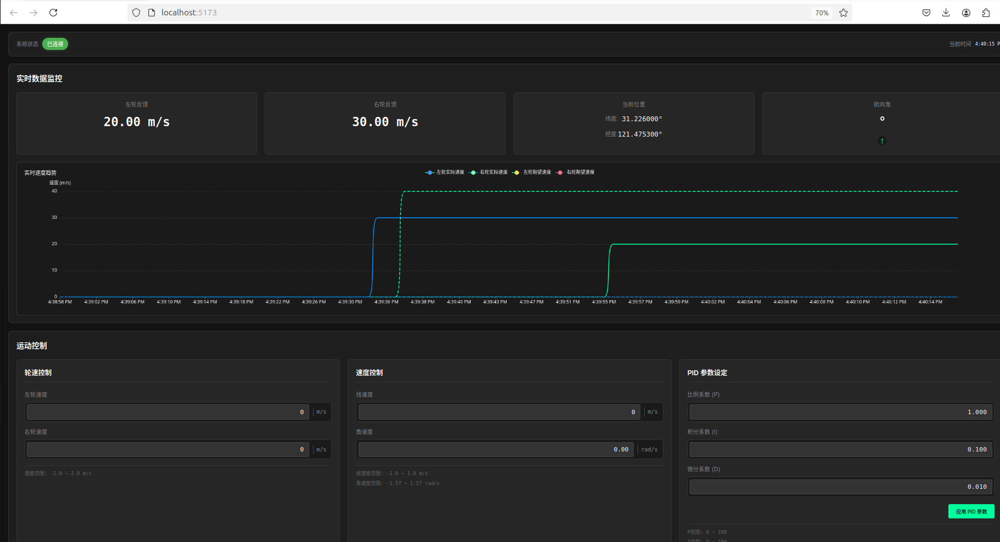

# Node.js(v21.0.0) + React(18.3.12) + Vite + RCLNODEJS (ROS2)



## RUN 

npm run dev

node test_backend.js

## ROS2 测试命令

与网页上位机交互 

1. 订阅速度控制命令:
   ```bash
   ros2 topic echo /cmd_vel
   ```


2. 订阅左右轮目标速度:
   ```bash
   ros2 topic echo /wheel_left/target
   ros2 topic echo /wheel_right/target
   ```


3. 订阅车辆参数:
   ```bash
   ros2 topic echo /vehicle_params
   ```
 

4. 订阅PID参数:
   ```bash
   ros2 topic echo /pid_params
   ```


5. 订阅左右轮PID参数:
   ```bash
   ros2 topic echo /pid_params_left
   ros2 topic echo /pid_params_right
   ```


6. 发布左右轮速度反馈、目标速度、车辆参数反馈、GPS位置、航向角和PID参数反馈:
   ```bash
   ros2 topic pub /wheel_left/feedback std_msgs/msg/Float64 "data: 5.0"
   ros2 topic pub /wheel_right/feedback std_msgs/msg/Float64 "data: 5.0"
   ros2 topic pub /wheel_left/target_speed std_msgs/msg/Float64 "data: 10.0"
   ros2 topic pub /wheel_right/target_speed std_msgs/msg/Float64 "data: 10.0"
   ros2 topic pub /vehicle_params_feedback std_msgs/msg/String "data: '{\"wheelRadius\": 0.1, \"vehicleWidth\": 0.5, \"vehicleLength\": 0.8}'"
   ros2 topic pub /gps/fix sensor_msgs/msg/NavSatFix "{latitude: 31.2260, longitude: 121.4753, altitude: 10.0}"
   ros2 topic pub /heading std_msgs/msg/Float32 "data: 45.0"
   ros2 topic pub /pid_params_feedback std_msgs/msg/String "data: '{\"p\": 1.0, \"i\": 0.1, \"d\": 0.01}'"
   ros2 topic pub /pid_params_left_feedback std_msgs/msg/String "data: '{\"p\": 1.0, \"i\": 0.1, \"d\": 0.01}'"
   ros2 topic pub /pid_params_right_feedback std_msgs/msg/String "data: '{\"p\": 1.0, \"i\": 0.1, \"d\": 0.01}'"
   ```
